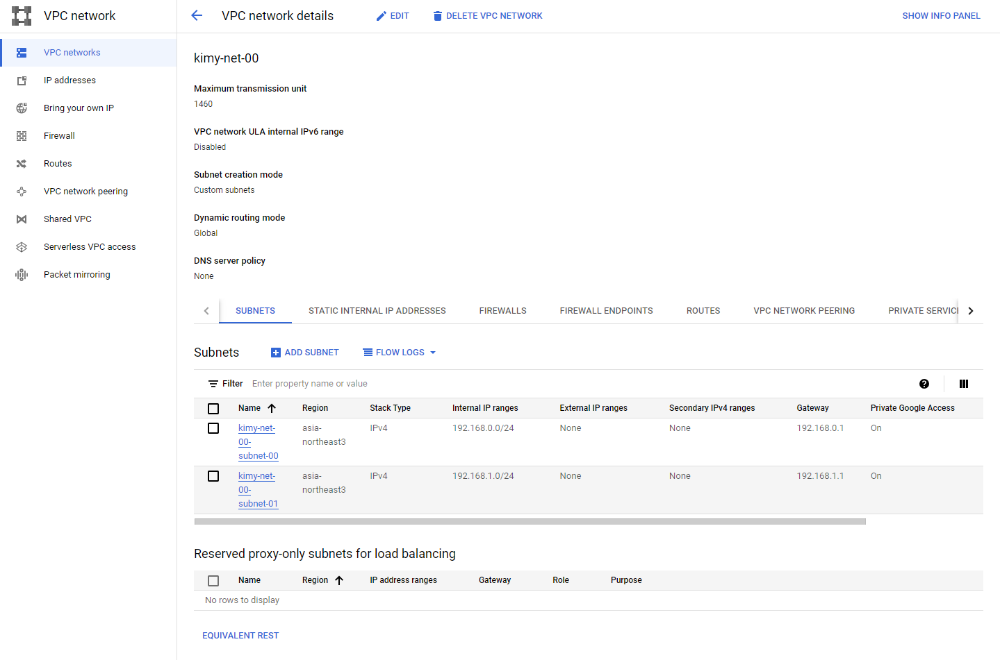
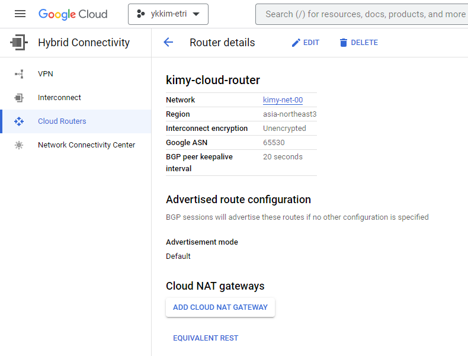
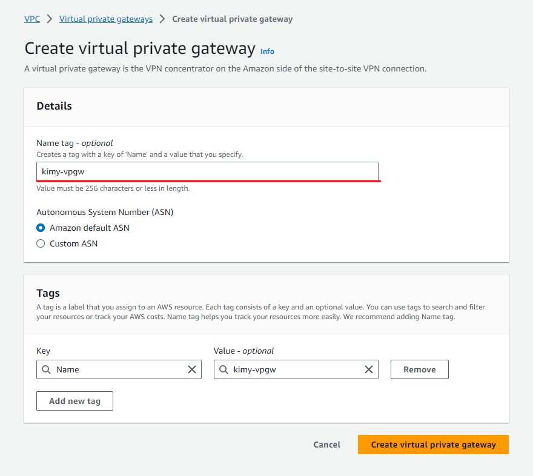
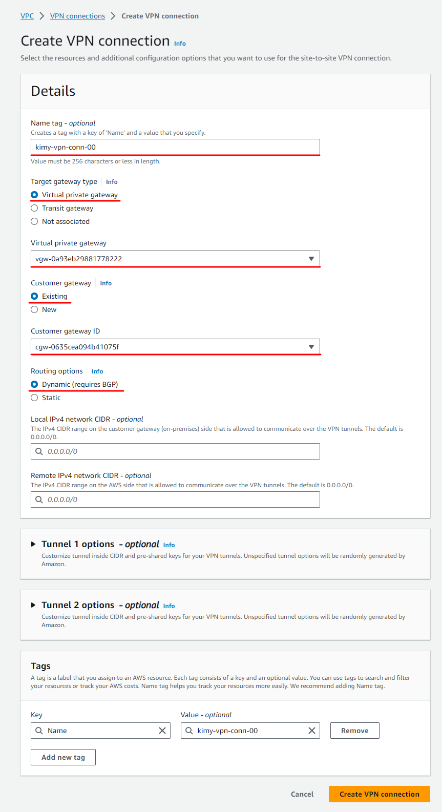

## Multi-cloud network configuration by HA VPN connections

In this article, I'd like to share a brief idea about how to configure multi-cloud network by high availability (HA) virtual private network (VPN) connections.

Related articles:
- [sample-design-for-multi-cloud-network-configuration](sample-design-for-multi-cloud-network-configuration.md)
- [resources-related-to-configure-multi-cloud-network](resources-related-to-configure-multi-cloud-network.md)
### Multi-cloud network configuration

I will configure multi-cloud network between Google Cloud Platform (GCP) and Amazon Web Service (AWS). This will enable direct communication between VPC networks on both cloud platforms.

#### Create a VPC network with 2 subnets on GCP

Form

Created VPC and subnets

#### Create a VPC and 2 subnets on AWS

Form

Form

Created VPC and networks

#### Create a Security Group

Form

Created security group

#### Create a Cloud Router on GCP

Form

Created Cloud Router

**!!! Take notes !!!**
`Google ASN` is going to be used to create customer gateways on AWS.

#### Create a Cloud VPN gateway on GCP

Form

Created Cloud VPN gateway

**!!! Take notes !!!**
IP addresses of two interfaces (i.e., `Interface: 0` and `Interface:1`) are going to be used to create customer gateways on AWS.

#### Create 2 customer gateways on AWS

Form of customer gateway 1 of 2

Form of customer gateway 2 of 2

Created customer gateways

#### Create a virtual private gateway

Form

Created virtual private gateway

Form of attach to VPC

Attached virtual private gateway

Note - It takes some time to attach.

#### Create site-to-site VPN connnections on AWS

Form of site-to-site VPN connection 1 of 2

Form of site-to-site VPN connection 2 of 2

Created site-to-site VPN connections

Note - It takes some time to become available state.

#### Download configuration of site-to-site VPN connections on AWS

Location (select connection > click download configuration)

Form of downalod configuration

Downloaded configurations

Note - It will be used to establish VPN tunnels on GCP

#### Add VPN tunnels on GCP

Form to add a peer VPN gateway

In the 2 downloaded files on AWS, I can find 4 IP Addresses of Virtual Private Gateway. Please see below.

Form to edit VPN tunnels 

In the 2 downloaded files on AWS, I can find 4 Pre-Shared Keys. Please see below.

Configure BGP sessions 

Configure a BGP session for kimy-tunnel-00

Repeat this for kimy-tunnel-01, kimy-tunnel-02, and kimy-tunnel-03

In the 2 downloaded files on AWS, I can find
- Customer Gateway IP address to assign as Cloud Router BGP IPv4 address,
- Virtual Private Gateway to assign as BGP peer IPv4 address, and
- Virtual Prrivate Gateway ASN to assign Peer ASN.

Added VPN tunnels

#### Check routes on GCP
Routing rules are automatically registered.

#### Check route tables on AWS

Edit route propagation

Propagated rules

### Multi-cloud network verification

Verification is performed through a ping test between two virtual machines.
#### Create an instance on AWS

#### Create a VM instance on GCP

#### Add firewall rule on GCP
Allow to 22 to access VM instnace by GCP SSH-in-browser

#### Ping test

VM instance on GCP

Cool~~~

### Clean up all resources
Proceed in reverse order of creation

1. Remove firewall rules
2. Remove instances
3. Diable route propagation on AWS
4. Delete Cloud VPN tunnels on GCP
5. Delete peer VPN gateway on GCP
6. Delete site-to-stie VPN connections on AWS
7. Detach the virtual private gateway from the VPC on AWS
8. Delete the virtual private gateway on AWS
9. Delete customer gateways on AWS
10. Delete Cloud VPN gateway on GCP
11. Delete Cloud Router on GCP
12. Delete security group on AWS
13. Delete subnets on AWS
14. Delete VPC on AWS
15. Delete VPC and subnets on GCP

That's it :-)

#### References
* [자동화된 네트워크 배포: Terraform으로 Google Cloud 및 AWS 간 VPN 빌드](https://cloud.google.com/architecture/automated-network-deployment-multicloud?hl=ko) on October 24, 2017 by Google Cloud
* [Terraform examples for HA VPN gateways](https://cloud.google.com/network-connectivity/docs/vpn/how-to/automate-vpn-setup-with-terraform#to_an_external_peer_network) on October 9, 2023 by Google Cloud
* [[GCP #11] AWS와 GCP 간의 HA VPN 연결](https://blog.naver.com/PostView.naver?blogId=blueday9404&logNo=223055342609) on March 25, 2023 by IT Blue