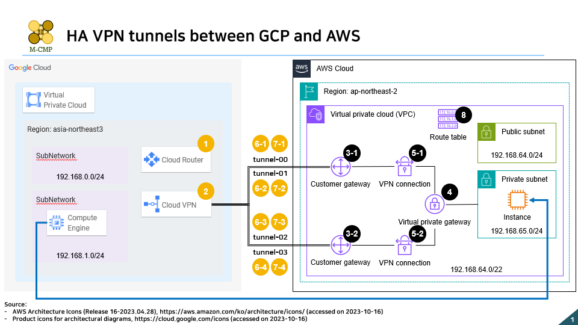

### Resources related to configure multi-cloud network
#### A concept of HA VPN tunnels between GCP and AWS

#### Required resources

| No. | Cloud Platform |      Required resources       | 
| ---:|:--------------:|:-----------------------------:|
|   1 |      GCP       |         Cloud Router          |
|   2 |      GCP       |       Cloud VPN Gateway       |
|   3 |      AWS       |       Customer gateway        |
|   4 |      AWS       |    Virtual private gateway    |
|   5 |      AWS       | (Site-to-site) VPN connection |
|   6 |      GCP       |       Peer VPN gateway        |
|   6 |      GCP       |          VPN tunnels          |
|   7 |      GCP       |         BGP sessions          |
|   8 |      AWS       |          Route table          |
